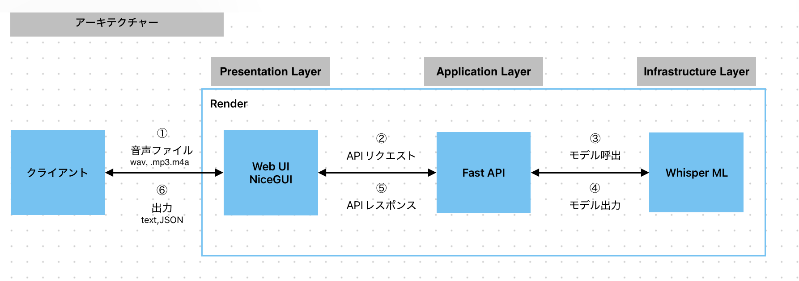

# 📘 音声文字起こしアプリ（Whisper + FastAPI + NiceGUI）

このプロジェクトは、OpenAIの Whisper モデルを使って音声ファイル（mp3, m4a, wav）を文字起こしするアプリです。NiceGUI による Web UI から音声ファイルをアップロードし、FastAPI 経由で非同期処理を行い、テキスト・JSONで結果を取得できます。

## 🏗 システム構成（3層アーキテクチャ）

  
※Gradio：Pythonコードを簡単にWeb UI化できるツール

- **プレゼンテーション層**（NiceGUI）  
  音声ファイルのアップロード、結果の表示

- **アプリケーション層**（FastAPI）  
  リクエストの受け取りと処理の制御

- **データ処理層**（Whisper）  
  音声 → テキストへの変換処理
